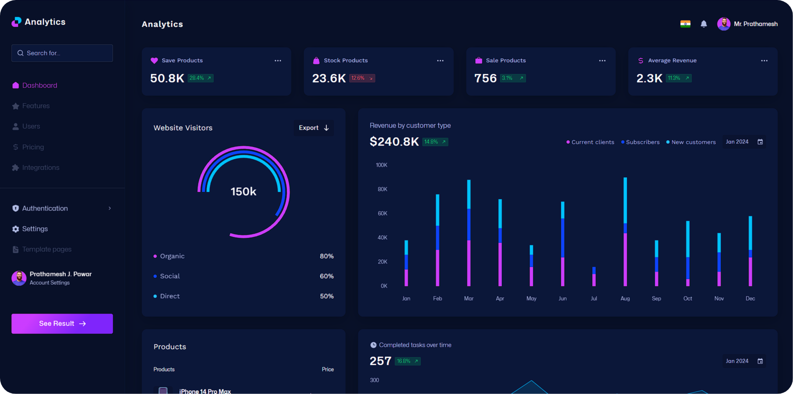

# Analytics Dashboard - [Live](https://analytics-ten-sigma.vercel.app/)

Welcome to the Analytics Dashboard project! This repository contains the code for my web application that provides a data-driven dashboard for visualizing key metrics and insights.

## About the Project

The Analytics Dashboard is designed to give users an intuitive interface to explore and visualize important metrics. It allows users to view data visualizations such as charts, graphs, and tables, making it easy to monitor business or personal data effectively.

## Screenshot



## Features

- **📊 Data Visualization**: View key metrics through interactive charts and graphs.
- **🔍 Real-Time Analytics**: Stay up-to-date with real-time data updates and insights.
- **📑 Custom Reports**: Generate and view reports based on specific filters and time ranges.
- **📱 Fully Responsive**: Optimized for use on any device, providing a smooth experience on both desktops and mobile devices.

## Technologies Used

- **Frontend**: React, Chart.js, Tailwind CSS
- **Hosting**: Vercel

## How to Use

1. Clone this repository:
   ```bash
   git clone https://github.com/Prathmeshpawar21/web-dashboard.git
   ```
2. Navigate to the project directory:
   ```bash
   cd analytics-dashboard
   ```
3. Install dependencies:
   ```bash
   npm install
   ```
4. Run the development server:
   ```bash
   npm start
   ```
5. Open your browser and visit:
   ```
   http://localhost:3000
   ```

## Deployment

This platform is hosted on Vercel. To deploy:
1. Link the repository to your Vercel account.
2. Push changes to the `main` branch, and Vercel will automatically deploy the updates.

---

Thank you for exploring my Analytics Dashboard! If you find this project helpful, please give it a ⭐ to show your support.
